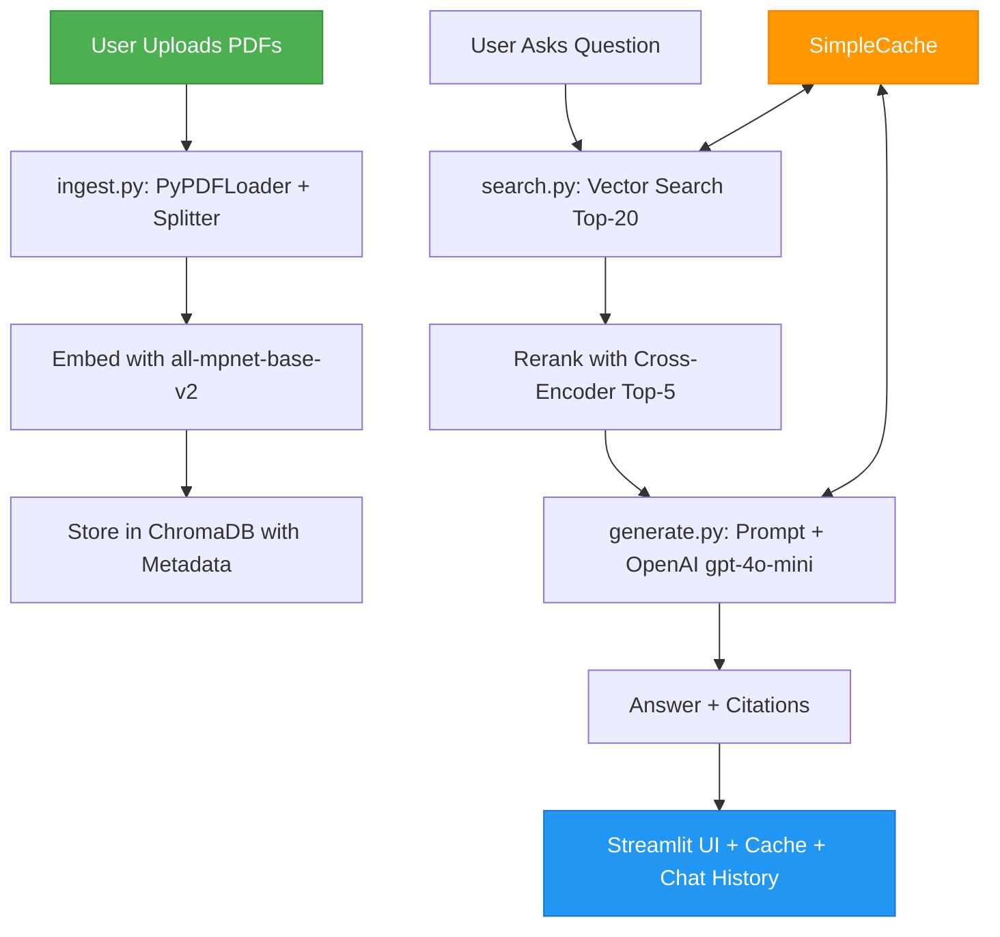

# 🤖 PolicyBot AI: Multi-Document RAG Assistant

A robust **Retrieval-Augmented Generation (RAG)** system for generating **grounded, cited answers** from complex insurance policy documents.

[](https://streamlit.io)
[](https://www.trychroma.com)
[](https://openai.com)

---

## 📄 Problem Statement

Insurance policies are **long, legal, and complex**.  
Customers, agents, and compliance teams need **fast, accurate, and cited answers** to questions about coverage and terms.

- **LLMs alone** often hallucinate when used without context.  
- **Keyword search** fails to capture semantic meaning.  

### 💡 Solution

**PolicyBot AI** is a **component-based RAG system** that:
1. Ingests multiple PDF policies and chunks them into knowledge units.  
2. Uses **semantic embeddings** for contextual retrieval.  
3. Applies **reranking** for precision.  
4. Generates **grounded answers with citations** using `OpenAI gpt-4o-mini`.  

---

## 🏗️ System Architecture

A lightweight, fully explainable 3-stage RAG pipeline — **Retrieve → Rerank → Generate** — built using specialized Python components instead of heavy frameworks.

### 🔁 End-to-End Workflow



---

## ⚙️ Component Breakdown

| Stage | Files | Libraries / Models | Purpose |
| :---- | :---- | :----------------- | :------ |
| **Ingestion** | `ingest.py`, `config.py` | `langchain_community.PyPDFLoader`, `RecursiveCharacterTextSplitter` | Load PDFs and split into overlapping text chunks. |
| **Embedding** | `ingest.py` | `sentence-transformers/all-mpnet-base-v2` | Create dense vector representations for semantic meaning. |
| **Vector Store** | `search.py` | `ChromaDB PersistentClient` | Efficiently store and retrieve policy chunks. |
| **Reranking** | `search.py` | `Cross-Encoder/ms-marco-MiniLM-L-6-v2` | Reorder top-20 retrieved chunks by semantic similarity. |
| **Answer Generation** | `generate.py` | `OpenAI/gpt-4o-mini` | Generate concise, factual answers grounded in retrieved context. |
| **Caching** | `cache.py`, `app.py` | `shelve` | Store `(answer, context)` pairs to reduce API calls. |
| **Interface** | `app.py` | `Streamlit` | User-friendly front-end for document upload and chat. |

---

## 🧰 Installation & Setup

### Prerequisites
- Python 3.8+
- OpenAI API key

### 1️⃣ Clone the Repository
```bash
git clone https://github.com/<your-username>/Policy-Bot-AI.git
cd Policy-Bot-AI
```

### 2️⃣ Create and Activate a Virtual Environment
```bash
python -m venv venv
source venv/bin/activate        # On Windows: venv\Scripts\activate
pip install -r requirements.txt
```

### 3️⃣ Configure OpenAI Key
Create a file named `open_api.py`:
```python
# open_api.py
api_key = "sk-your-openai-key"
```

### 4️⃣ Run the App
```bash
streamlit run app.py
```

---

## 💬 How to Use

1. **Upload** one or more PDF insurance policy documents via the sidebar.  
2. **Process** documents → embeddings stored in `chroma_db`.  
3. **Ask** a natural-language question about your uploaded policies.  
4. **Receive** a grounded answer with citations (document, chunk ID, and page).  

The chat also shows:
- ⏱ **Response time**
- 🟢 / 🔵 **Cache status**

---

## 📁 Project Structure

```
Policy-Bot-AI/
├── app.py                 # Streamlit UI + chat logic
├── cache.py               # Persistent caching with shelve
├── config.py              # Central config for models & paths
├── generate.py            # RAG prompt + OpenAI completion
├── ingest.py              # PDF processing + embedding
├── search.py              # Retrieval + reranking
├── open_api.py            # Your API key (not committed)
├── flowchart.png          # Architecture diagram (optional)
└── chroma_db/             # Local vector store
```

---

## 🧠 Key Highlights

- ⚡ **Fast Semantic Search** — powered by `all-mpnet-base-v2`
- 🎯 **Precise Context Reranking** — using a lightweight cross-encoder
- 🧾 **Grounded Answers** — every output includes policy citations
- 💾 **Caching System** — minimizes repeated API calls
- 🧩 **Modular Design** — each component independently testable

---

## 📈 Future Enhancements

- 🔍 Add multi-PDF metadata filters (policy type, insurer, date)  
- 🗃️ Migrate cache to SQLite for analytics  
- 📊 Add token & cost logging dashboard  
- 🌐 Optional LangChain integration for hybrid retrieval  

---

## 👨‍💻 Authors

[Reetesh Nigam](https://github.com/nigamreetesh84)

---

> *PolicyBot AI demonstrates how modular RAG design can transform static documents into interactive, verifiable knowledge systems.*
